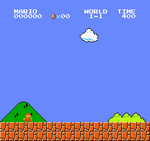

# 🕹️👾 Reinforcement Learning aplicado a *Super Mario Bros* 👾🕹️

---

## 🎯 Presentación de la práctica

Se entrega un **notebook modificado** para facilitar la comprensión y ejecución de la práctica desarrollada.  
Este cuaderno ha sido adaptado eliminando las celdas de los tutoriales de ejemplo y añadiendo nuevas secciones para mejorar el flujo de trabajo y el entendimiento del código.

---

## 🏁 Resultado obtenido

<figure style="text-align: center; margin-top: 20px;">
  
  <figcaption style="font-style: italic; color: #555; margin-top: 10px;">
    🏆 Mejor entrenamiento logrado: <strong>PPO_CNN_3005_3</strong>
  </figcaption>
</figure>

---

## 📦 Estructura del notebook

El notebook se organiza en **cuatro secciones principales**:

1. ⚙️ **Configuración del entorno**  
   Preparación del entorno con Gym y SuperMarioBros, junto con wrappers personalizados.
2. 🛠️ **Modificación y ampliación**  
   Implementación de funciones de recompensa, normalización, y stack de frames.
3. 🧠 **Entrenamiento del agente**  
   Uso de PPO con `CnnPolicy`, ajuste de hiperparámetros y visualización con TensorBoard.
4. 📈 **Evaluación de desempeño**  
   Evaluación cuantitativa y cualitativa con grabación de episodios como GIFs.

---

## 💻 Requisitos

- Python 3.8+
- Stable-Baselines3
- Gym SuperMarioBros
- OpenCV
- Matplotlib
- Tensorboard

---

## 🚀 Cómo ejecutar

1. Clona el repositorio.
2. Crea y activa un entorno virtual:  
   `python -m venv .venv && source .venv/bin/activate` (Linux/Mac)  
   `.\.venv\Scripts\activate` (Windows)
3. Instala dependencias:  
   `pip install -r requirements.txt`
4. Ejecuta el notebook:  
   `jupyter notebook mario_rl.ipynb`

---

## 📂 Estructura del proyecto

```
📁 DeepRL_SuperMario/
├── 📁 .venv/                  	   → Entorno virtual de Python
├── 📁 docs/                   	   → Documentación del proyecto
├── 📁 final_models/           	   → Modelos PPO entrenados 
│   └── 📦 PPO_CNN_2705_1.zip ...
├── 📁 mario_logs/             	   → Logs de entrenamiento
├── 📁 mario_models/           	   → Modelos intermedios 
├── 📁 mario_monitor_dir/      	   → Información de episodios
├── 📁 media/                  	   → Gifs e imágenes 
│   ├── 📁 gifs/    			         → Render de los agentes jugando
│   │   └──	🎞️ PPO_CNN_2705_2.gif ...	
│   └── 📁 images/    			      → Output finales de los entrenamientos
│       └──	🖼️ PPO_CNN_2705_2.png ...
├── 📁 src/                    	   → Código de backup
├── 📦 mario_final_model.zip   	   → Modelo PPO final entrenado
├── 📓 mario_rl.ipynb           	   → Notebook de la práctica
└── 📄 requirements.txt        	   → Dependencias del entorno

```

---

## ✨ Autoría

Desarrollado como práctica académica. Recomendado ver el código completo y ejecutar las pruebas para comprender a fondo el aprendizaje por refuerzo aplicado a videojuegos clásicos.

---
